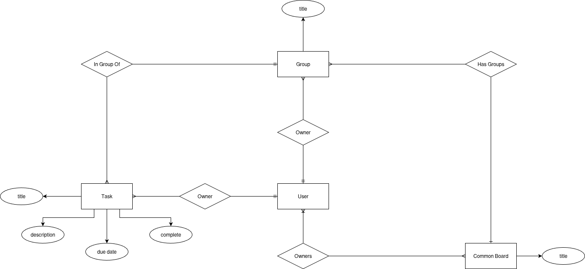

# Todo

This project creates a simple todo list web application. Using Django as the web
server to service both front and back end elements as well as a convienent connection
to a database engine. To run this web app, follow the steps in the **Launch** section
of this document.

This project is of a simple Todo list application. Users are able to login with
their credentials and see their lists of tasks. They can add, edit, delete, or 
mark complete tasks within their groups. Similarly, they should be able to add,
edit, and delete groups. A REST API was provided to allow for the development of
a single page application and a potential mobile app project. Please see the 
**Design Considerations** section of this document for more information.

## Launch

Before starting the web server, you will need to ensure that you have all of the 
dependencies listed below:

* Python3
* Django
* Channels
* Redis
* channels_redis
* Docker (Used for Redis server)
* daphne

Almost all of the above dependencies can be installed using pip. This project was built
using and is intended to be used with a Python enviornment. This project was written
using a Linux operating system and as such, there may be problems running it on Windows
or macOS (specifically when considering the file line endings).

To launch the server, first launch the redis server using the following command:

`$ docker run --rm -p 6379:6379 redis:7`

Once the Redis server is running, ensure that your terminal is in _./Todo/Todo/_ and 
run the command:

`$ python3 manage.py runserver`

Note that in some terminals enviornments it is required to specify file names prefixed
with the local path (e.g., "*.\manage.py*"). If there are problems running the program 
ensure that the migrations are updated by running the commands:

`$ python3 manage.py makemigrations`

and

`$ python3 manage.py migrate`

## Design Considerations

While the app has front and back end features including webpages, the focus was on the 
backend. A REpresentation State Transfer (REST) API was created as a method of allowing
different front-ends to communicate with the same server allowing for the potential 
support of cross platform applications (e.g., mobile). This also provides the ability
for the web app to provide a single (or few) page application. This can provide benefits
in the execution speed as the server will be recieving requests and returning JSON
objects rather than full webpages with styling and scripts.

The REST API is summerized below:

<table>
  <tr>
    <th>URL</th>
    <th>Method</th>
    <th>Purpose</th>
  </tr>
  <tr>
    <td><code>/task/info/&lt;ID&gt;</code></td>
    <td>GET</td>
    <td>Returns the information pretaining to the specified task.</td>
  </tr>
  <tr>
    <td><code>/task/edit/&lt;ID&gt;</code></td>
    <td>PUT</td>
    <td>Updates the infomration of the specified task.</td>
  </tr>
  <tr>
    <td><code>/task/delete/&lt;ID&gt;</code></td>
    <td>GET</td>
    <td>Deletes the specified task.</td>
  </tr>
  <tr>
    <td><code>/task/new</code></td>
    <td>PUT</td>
    <td>Creates a new task.</td>
  </tr>
  <tr>
    <td><code>/group/info/&lt;ID&gt;</code></td>
    <td>GET</td>
    <td>Returns the information pretaining to the specified group.</td>
  </tr>
  <tr>
    <td><code>/group/edit/&lt;ID&gt;</code></td>
    <td>PUT</td>
    <td>Updates the information for the specified group.</td>
  </tr>
  <tr>
    <td><code>/group/delete/&lt;ID&gt;</code></td>
    <td>GET</td>
    <td>Deletes the specified group.</td>
  </tr>
  <tr>
    <td><code>/group/new</code></td>
    <td>PUT</td>
    <td>Creates a new group.</td>
  </tr>
  <tr>
    <td><code>/user/tasks</code></td>
    <td>PUT</td>
    <td>Returns a list of all of the task IDs of the user.</td>
  </tr>
  <tr>
    <td><code>/user/groups</code></td>
    <td>PUT</td>
    <td>Returns a list of all of the group IDs of the user.</td>
  </tr>
  <tr>
    <td><code>/project/&lt;ID&gt;/task/new</code></td>
    <td>PUT</td>
    <td>Creates a new task for the specified project ID.</td>
  </tr>
  <tr>
    <td><code>/project/&lt;ID&gt;/task/edit/&lt;task-ID&gt;</code></td>
    <td>PUT</td>
    <td>Updates task information for the specified project ID.</td>
  </tr>
  <tr>
    <td><code>/project/&lt;ID&gt;/task/delete/&lt;task-ID&gt;</code></td>
    <td>GET</td>
    <td>Deletes a task within the specified project ID.</td>
  </tr>
  <tr>
    <td><code>/project/&lt;ID&gt;/group/new</code></td>
    <td>PUT</td>
    <td>Creates a new group within the specified project ID.</td>
  </tr>
  <tr>
    <td><code>/project/&lt;ID&gt;/group/edit/&lt;group-ID&gt;</code></td>
    <td>PUT</td>
    <td>Updates group information for the specified project ID.</td>
  </tr>
  <tr>
    <td><code>/project/&lt;ID&gt;/group/delete/&lt;group-ID&gt;</code></td>
    <td>GET</td>
    <td>Deletes a group within the specified project ID.</td>
  </tr>
</table>

Additionally, the webserver makes use of websockets as a means to keep the UI consistent 
when the user is logged in on multiple computers as well as to facilitate the collaborative
features. The Websocket implementation was designed to incorperate the REST API. Some of the 
API's methods are not called in this project but left to allow for extending the application
at a later date. There are two consumers (websocket classes) that are used. The first is 
called __UserConsumer__ and it ensures that multiple sessions for the same user are up-to-date
and consistent. The second consumer is called __CommonConsumer__ and it manages the multi-user
groups that facilitate the collaborative features.

The __UserConsumer__ connects all sessions for the same user together and ensures that they 
are updated to be in sync with each other. When a user visits a page with volitile data (
information that can be updated at a moment's notice) then they connect to the websocket server
and are assigned to a group for their user only. If the user updates information the websocket
will send the update notice to all other user sessions under the same account to check for updates.

The __CommonConsumer__ connects all users for a specific common board group together. Each common 
group gets a single consumer instance. If a given user has five common group boards then they will
have a single consumer instance for __UserConsumer__ and five instances for __CommonConsumer__. In
this scenario, each __CommonConsumer__ instance handles the communication for that specific common
group rather than tailor its support to the user. Because of this, the __CommonConsumer__ will work
with a single taskboard object in the client code.

## API Reference

The API uses a REST design whereby JSON objects are sent from and to the web server. This section 
describes the expected conventions when communicating with the various API endpoints. The API urls
are presented in a table within the Design Considerations section.

### New Task (/task/new)

This API endpoint creates a new task object. It accepts a JSON object and will return the ID of the
new task object.

__Input__:
<table>
  <tr>
    <th>Field Name</th>
    <th>Required</th>
    <th>Type</th>
    <th>Description</th>
  </tr>
  <tr>
    <td><code>title</code></td>
    <td>True</td>
    <td>String</td>
    <td>The title of the new task object.</td>
  </tr>
  <tr>
    <td><code>group</code></td>
    <td>True</td>
    <td>Int</td>
    <td>The id that the task is assigned under.</td>
  </tr>
  <tr>
    <td><code>description</code></td>
    <td>False</td>
    <td>String</td>
    <td>A short description of the new task object.</td>
  </tr>
  <tr>
    <td><code>due_date</code></td>
    <td>False</td>
    <td>JSON</td>
    <td>The due date of the new task object.</td>
  </tr>
</table>

__Output__:
<table>
  <tr>
    <th>Field</th>
    <th>Type</th>
    <th>Description</th>
  </tr>
  <tr>
    <td><code>ID</code></td>
    <td>Int</td>
    <td>The id of the new task object.</td>
  </tr>
</table>

### Edit Task (/task/edit/&lt;id&gt;)

This API endpoint is used to edit an existing task object. It accepts a similar JSON object to that of 
the new task endpoint and returns HTTP status codes.

__Input__:
<table>
  <tr>
    <th>Field</th>
    <th>Required</th>
    <th>Type</th>
    <th>Description</th>
  </tr>
  <tr>
    <td><code>title</code></td>
    <td>False</td>
    <td>String</td>
    <td>The updated title of the task object.</td>
  </tr>
  <tr>
    <td><code>group</code></td>
    <td>False</td>
    <td>Int</td>
    <td>The group id of the new group that the task is assigned under.</td>
  </tr>
  <tr>
    <td><code>description</code></td>
    <td>False</td>
    <td>String</td>
    <td>The updated description string of the task object.</td>
  </tr>
  <tr>
    <td><code>due_date</code></td>
    <td>False</td>
    <td>JSON</td>
    <td>The updated due date for the task object.</td>
  </tr>
  <tr>
    <td><code>complete</code></td>
    <td>False</td>
    <td>Boolean</td>
    <td>The updated completion status of the task.</td>
  </tr>
</table>

__Output__:
This API endpoint does not return a JSON object but will response with HTTP status codes.

### Task Info (/task/info/&lt;id&gt;)

This API endpoint returns the information pretaining to the specified task. It does not accept a JSON 
object but relies on the ID value passed through the URL.

__Output__:
<table>
  <tr>
    <th>Field</th>
    <th>Type</th>
    <th>Description</th>
  </tr>
  <tr>
    <td><code>ID</code></td>
    <td>Int</td>
    <td>The id of the task object (same as the ID passed through the URL).</td>
  </tr>
  <tr>
    <td><code>title</code></td>
    <td>Text</td>
    <td>The title that is displayed to the user for quick reference.</td>
  </tr>
  <tr>
    <td><code>description</code></td>
    <td>Text</td>
    <td>A short description used to provide additional detail about the task.</td>
  </tr>
  <tr>
    <td><code>completed</code></td>
    <td>Boolean</td>
    <td>True if the task is complete and False if the task is not yet complete.</td>
  </tr>
  <tr>
    <td><code>due_date</code></td>
    <td>JSON or Null</td>
    <td>The date at which the user has determined that the task must be completed by.</td>
  </tr>
  <tr>
    <td><code>group</code></td>
    <td>JSON</td>
    <td>Information about the group that contains the task object.</td>
  </tr>
  <tr>
    <td><code>owner</code></td>
    <td>JSON</td>
    <td>Information about the owner of the task object.</td>
  </tr>
</table>

### New Group (/group/new)

__Input__:
<table>
  <tr>
    <th>Field</th>
    <th>Required</th>
    <th>Type</th>
    <th>Description</th>
  </tr>
  <tr>
    <td><code>title</code></td>
    <td>True</td>
    <td>String</td>
    <td>The title of the new group object.</td>
  </tr>
  <tr>
    <td><code>board</code></td>
    <td>False</td>
    <td>Int</td>
    <td>The id of the common board that the group is assigned under. If not present or null then the group is created under the user's personal taskboard.</td>
  </tr>
</table>

__Output__:
<table>
  <tr>
    <th>Field</th>
    <th>Type</th>
    <th>Description</th>
  </tr>
  <tr>
    <td><code>ID</code></td>
    <td>Int</td>
    <td>The id of the new group.</td>
  </tr>
</table>

### Edit Group (/group/edit/&lt;id&gt;)

__Input__:
<table>
  <tr>
    <th>Field</th>
    <th>Required</th>
    <th>Type</th>
    <th>Description</th>
  </tr>
  <tr>
    <td><code>title</code></td>
    <td>False</td>
    <td>String</td>
    <td>The updated title of the group object.</td>
  </tr>
</table>

__Output__:
This API endpoint does not return a JSON object but will return HTTP status codes.

### Group Info (/group/info/&lt;id&gt;)

This API endpoint returns infopramtion pretaining to the specified group. It does not accept a JSON 
object but relies on the ID value passed through the URL.

__Output__:
<table>
  <tr>
    <th>Field</th>
    <th>Type</th>
    <th>Description</th>
  </tr>
  <tr>
    <td><code>title</code></td>
    <td>Text</td>
    <td>The title used to identity the group by the user.</td>
  </tr>
  <tr>
    <td><code>owner</code></td>
    <td>JSON</td>
    <td>Information about the owner of the group object.</td>
  </tr>
  <tr>
    <td><code>tasks</code></td>
    <td>Array</td>
    <td>An array of the tasks that are assigned under the specified group object.</td>
  </tr>
</table>

### New Common Board (/shared/new)

This API endpoint creates a new common board object and assigns the initial owner list to it.

__Input__:
<table>
  <tr>
    <th>Field</th>
    <th>Required</th>
    <th>Type</th>
    <th>Description</th>
  </tr>
  <tr>
    <td><code>title</code></td>
    <td>True</td>
    <td>String</td>
    <td>The title of the new common board object.</td>
  </tr>
  <tr>
    <td><code>users</code></td>
    <td>False</td>
    <td>Array</td>
    <td>List of the users who are to be added to the group initially.</td>
  </tr>
</table>

__Output__:
<table>
  <tr>
    <th>Field</th>
    <th>Type</th>
    <th>Description</th>
  </tr>
  <tr>
    <td><code>ID</code></td>
    <td>Int</td>
    <td>The ID of the new common board object.</td>
  </tr>
</table>

### Edit Common Board (/shared/edit/&lt;id&gt;)

This API endpoint updates the state of the specified common board by changing the title or adding/removing 
users.

__Input__:
<table>
  <tr>
    <th>Field</th>
    <th>Required</th>
    <th>Type</th>
    <th>Description</th>
  </tr>
  <tr>
    <td><code>title</code></td>
    <td>False</td>
    <td>String</td>
    <td>The title of the new common board object.</td>
  </tr>
  <tr>
    <td><code>add-users</code></td>
    <td>False</td>
    <td>Array</td>
    <td>The username of a user to add to the common board object.</td>
  </tr>
  <tr>
    <td><code>remove-user</code></td>
    <td>False</td>
    <td>String</td>
    <td>The username of a user to remove from the common board object.</td>
  </tr>
  <tr>
    <td><code>remove-self</code></td>
    <td>False</td>
    <td>String</td>
    <td>Remove the requesting user from the common board object. This field may be null and will still perform its operation.</td>
  </tr>
</table>

__Output__:
<table>
  <tr>
    <th>Field</th>
    <th>Type</th>
    <th>Description</th>
  </tr>
  <tr>
    <td><code>ID</code></td>
    <td>Int</td>
    <td>The ID of the common board object.</td>
  </tr>
  <tr>
    <td><code>title</code></td>
    <td>Text</td>
    <td>The title of the common board object that helps users identify it.</td>
  </tr>
  <tr>
    <td><code>users</code></td>
    <td>Array</td>
    <td>A list of users that are the owners of the common board object.</td>
  </tr>
</table>

### Common Board Info (/shared/info/&lt;id&gt;)

This API endpoint returns general information about the specified common board object. It does not accept 
a JSON object, but does return the results in one.

__Output__:
<table>
  <tr>
    <th>Field</th>
    <th>Type</th>
    <th>Description</th>
  </tr>
  <tr>
    <td><code>id</code></td>
    <td>Int</td>
    <td>The id of the specified common board object (same as the one used in the URL).</td>
  </tr>
  <tr>
    <td><code>title</code></td>
    <td>Text</td>
    <td>The name displayed for the common board.</td>
  </tr>
  <tr>
    <td><code>groups</code></td>
    <td>Array or Null</td>
    <td>Array of groups that exist within the common board object.</td>
  </tr>
  <tr>
    <td><code>owners</code></td>
    <td>Array</td>
    <td>Array of users who are part of the common board.</td>
  </tr>
</table>

### All Delete Endpoints.

This encompasses delete task (/task/delete/&lt;id&gt;) and delete group (/group/delete/&lt;id&gt;). These 
methods delete an instance of their respective objects. They do not accept JSON input nor do they return it. 
Their only method of returning values is in HTTP response codes. 

## Database Schema

## Styling

The CSS code was written for this project and takes inspiration from Bootstrap. The CSS 
styling includes styling for HTML elements, as well as compound elements and page layout.
Compound elements are those that are comprised of HTML elements (e.g., button groups). Any
additional scripting needed for them will be implemented in JavaScript files located in the
_/static/basic_light/compound/_ folder.

## Taskboard and Client Side Code

The client side code is written in traditional JavaScript using elements that are cross platform and
are not depreciated. Generally, this code should work on any modern HTML5 complient browser, but is
tested on Firefox and Brave. The client side code mainly uses JavaScript modules to provide a modern
and clean organizational structure. The term _Controller_ is used to denote that those JavaScript files
exist to provide driver code for specific web pages. A driver only contains code that will be used 
exclusively on one web page. The table below associated the driver files with their web pages.

<table>
  <tr>
    <th>Driver Name</th>
    <th>URL</th>
  </tr>
  <tr>
    <td>dashboard.js</td>
    <td><code>/home</code></td>
  </tr>
  <tr>
    <td>shareboard.js</td>
    <td>
      <code>/shared</code>    
    </td>
  </tr>
</table>

The modules include taskboard, user_socket, and task. The _task_ module contains utilities for representing,
and extracting, tasks within the client code. The _taskboard_ module contains the taskboard class which 
handles all UI operations for the taskboard. These include adding groups or tasks to the taskboard. Note that
taskboard does not contain functionallity that communicates with the server or web socket. It does provide
hooks that will be executed when certain events occur (e.g., user clicks new task button or user clicks the
task to edit it). The _user socket_ module handles communication with the web socket server. This includes
the initial connection and handling requests. As with the taskboard class, the UserSocket class has hooks for
events that occur in response to information received from the web socket server.

Note that the code contained in the taskboard module needs to be accompanied by the "taskboard.css" file.

